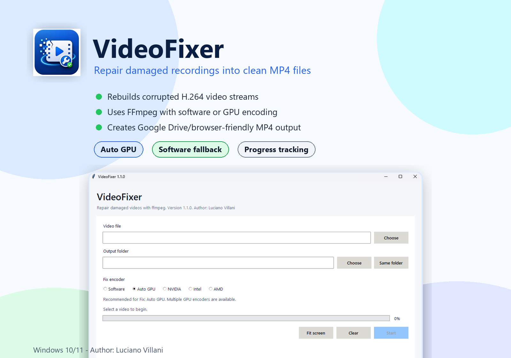
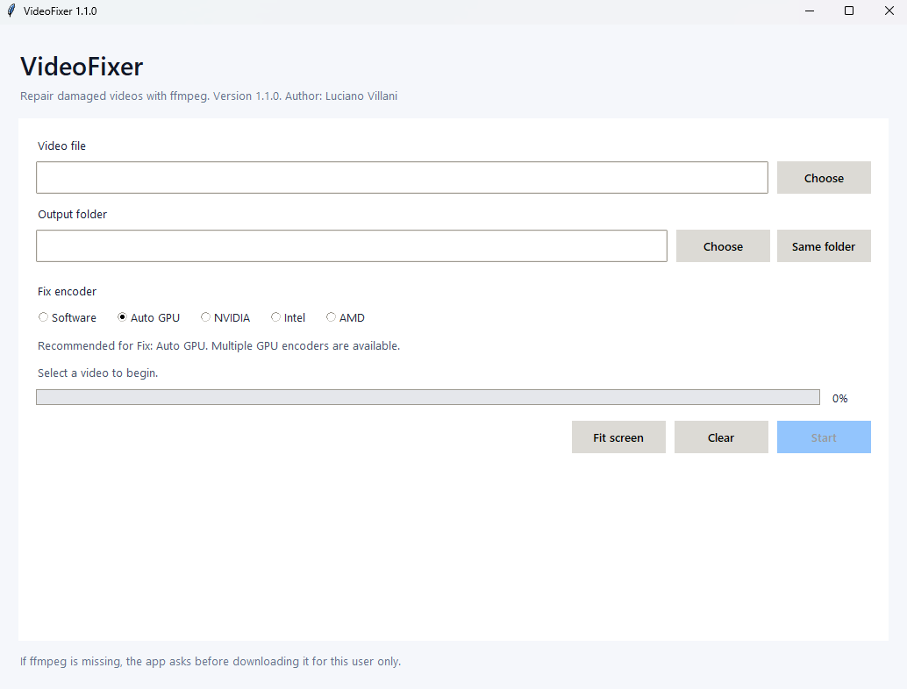

# VideoFixer

<p align="center">
  
</p>

Version: 1.2.4

A small Windows 10/11 interface for repairing videos with ffmpeg.

Author: Luciano Villani



VideoFixer rebuilds damaged MP4 video streams into cleaner, Google Drive/browser-friendly MP4 files. It is designed for recordings that still play locally but fail to preview online because of H.264 reference-frame corruption.

## Real Interface



## Features

- Select a video file.
- Drag and drop a video onto the Video file field.
- When a video is selected, the output folder field is filled with the video's folder.
- Choose Software, Auto GPU, NVIDIA, Intel, or AMD encoding.
- The app recommends Software or GPU based on the detected graphics hardware and ffmpeg support.
- If GPU encoding fails at runtime, the app automatically retries with Software encoding.
- The Start button is enabled only after the required choices are made.
- Choose an output folder, or leave it empty to save beside the original video.
- Saves output as `original-name-fixed.ext`.
- Shows conversion progress.
- Uses a larger resizable window so the Start buttons and progress bar stay reachable.
- Can be resized normally or expanded with the Fit screen button.
- Detects ffmpeg automatically.
- If ffmpeg is missing, asks the user before downloading it to `%LOCALAPPDATA%\VideoFixer`.

## Fix Command

The app always rebuilds the H.264 video stream because copy/remux fixes do not repair frame-reference corruption.

Software encoding:

```powershell
ffmpeg -y -fflags +genpts+discardcorrupt -err_detect ignore_err -analyzeduration 100M -probesize 100M -i "input.mp4" -map 0:v:0 -map 0:a? -sn -dn -c:v libx264 -preset medium -crf 26 -pix_fmt yuv420p -c:a aac -b:a 128k -ac 2 -ar 48000 -max_muxing_queue_size 4096 -tag:v avc1 -movflags +faststart "fixed.mp4"
```

Software encoding uses the standard CPU-based H.264 encoder, so it works on PCs without a supported GPU.

This command is tuned for recordings with H.264 reference-frame errors such as `reference picture missing during reorder` and `Missing reference picture`.

The fix can also use GPU encoding when available:

- Auto GPU tries NVIDIA, then Intel, then AMD, and falls back to Software.
- NVIDIA uses `h264_nvenc`.
- Intel uses `h264_qsv`.
- AMD uses `h264_amf`.

GPU support depends on the PC hardware, drivers, and ffmpeg build. Software is the most compatible choice.

## Run From Source

```powershell
python main.py
```

## Build An EXE

Install PyInstaller:

```powershell
python -m pip install pyinstaller
```

Build:

```powershell
python -m PyInstaller --noconsole --onefile --name VideoFixer main.py
```

The executable will be created in `dist\VideoFixer.exe`.
